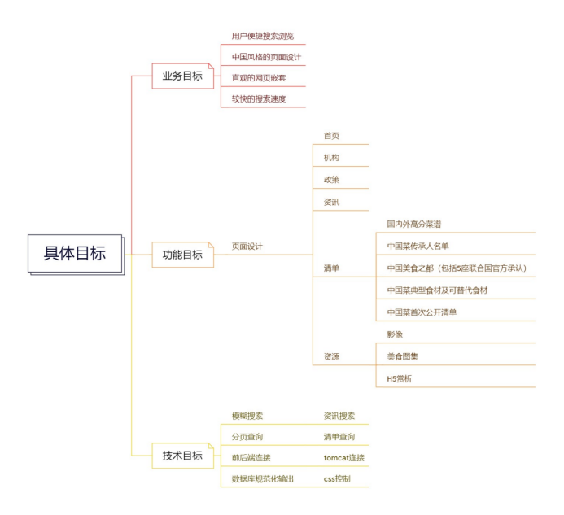

# 《中国菜宣传》-项目开发总结报告

# 1 引言

## 1.1 项目背景

随着全球化的发展和人们对不同文化的兴趣增加，中国菜在国际上越来越受到瞩目。中国菜作为世界上最古老、最丰富多样的烹饪文化之一，拥有悠久的历史和独特的烹饪技艺，各地的特色菜系更是让人目不暇接。然而，尽管中国菜的美食文化如此丰富，但在国际舞台上仍存在着信息传播不畅、了解不足的问题。

为了进一步宣传和推广中国菜，本项目旨在开发一个JavaWeb应用程序，主题为“中国菜宣传”。该应用程序将为用户提供一个交互式平台，使他们能够深入了解中国菜的历史、文化和各地的特色菜系。通过该应用程序，用户可以浏览菜谱、学习烹饪技巧、了解菜肴的起源和发展，并获取有关食材的信息。

该项目的目标是通过互联网技术和多媒体资源的应用，让更多人了解和欣赏中国菜的独特之处，促进中华美食文化的传承和发展。通过这个平台，用户可以分享他们自己的烹饪经验、推荐他们喜爱的中国菜肴，并参与讨论和交流。同时，该平台也将成为中国菜厨师和餐厅的展示窗口，让用户了解各个地区的名厨和著名餐厅，提供菜品推荐和预订服务。

在项目实施过程中，我们将采用JavaWeb开发技术，结合数据库管理系统和前端框架，构建一个功能完善、用户友好的应用程序。通过这个应用程序，我们希望能够增加对中国菜的认识和兴趣，推广中国菜在国际上的知名度，为中华美食文化的传播作出贡献。

## 1.2 术语和缩写词

列出本文件中用到的专门术语的定义和外文首字母组词的原词组。

前端所用技术：HTML CSS JS

后端所用技术：SpringBoot MyBatis Thymeleaf

# 2 项目概述

该项目是一个基于JavaWeb开发的应用程序，主题为“中国菜宣传”。旨在通过互联网技术和多媒体资源的应用，向用户展示和推广中国菜的独特魅力，促进中华美食文化的传承和发展。

该应用程序将提供以下主要功能：

1. 菜谱浏览和搜索：用户可以浏览各种中国高分菜肴的菜谱，了解制作方法、食材配料和烹饪技巧。用户还可以使用搜索功能查找特定菜肴或食材。
2. 宣传发扬优秀的中国菜文化：用户可以浏览优秀的中国菜简介，领略各大美食之都的风采，感受美妙的中国文化
3. 传承人名单：用户可以浏览各菜谱的作者，认识中国菜的创作者
4. 影像和图片集：网站提供了较多的中国菜美图和宣传视频，用户可以进行搜索查找
5. 资讯搜索：用户可以进行搜索，查看最近的中国菜新闻和资讯

## 2.1 项目目标

说明项目建设的总体目标和具体目标。项目目标应尽量细化、量化，如可以分为业务目标、功能目标，便于对目标进行考核和验收。

总体目标：宣传中国菜文化，让国内外的对美食有兴趣的用户能更加了解中国菜

具体目标：

## 2.2 业务需求

条目化地叙述本软件最终用户的原始业务需求，包括：业务指标、技术指标、总体功能需求、目标用户功能需求等，为需求分析提供支持。

### 2.2.1 业务指标

从业务的角度进行需求分析，分析与本项目相关的业务领域、机构与部门在业务运作、流程、管理、操作等方面对本项目的需求。根据不同的业务类型和部门，逐个进行梳理和分析，提出业务指标。

用户能高效快捷地搜索自己需要的菜谱等资源，管理员能方便修改论坛，清单的数据库，首次访问的用户可以清楚地了解到网页的内容和各个功能部分的分布情况

### 2.2.2 技术指标

列出本项目的主要技术指标。应用系统主要技术指标包括且不限于（系统响应时间、系统总体可用率、系统最大用户数、平均并发用户数、数据在线保存时间等）。

1. 系统响应时间：
2. 系统总体可用率：
3. 系统最大用户数：
4. 平均并发用户数：
5. 数据在线保存时间：
6. 用户界面友好性：评估用户界面的易用性和用户体验，包括界面设计、响应速度、交互性等方面的指标。
7. 数据处理速度：衡量系统处理大量数据的效率和速度。这包括数据的输入、存储、处理和输出等方面的性能。

## 2.3 运行环境

### 2.3.1 软件环境

罗列出系统运行所需要的软件环境，例如操作系统、Web服务器软件、数据库等。

1. 操作系统：Windows
2. 开发工具和集成开发环境（IDE）：Java开发工具包（JDK）、IntelliJ IDEA
3. 数据库管理系统（DBMS）：MySQL

### 2.3.2 硬件环境

简述系统运行所需要的硬件环境，包括应用服务器、数据库服务器等。

1. Web服务器：Tomcat
2. 前端框架和库：例如React、Vue.js、Bootstrap等。
3. 后端框架和库：SpringBoot MyBatis Thymeleaf
4. 版本控制工具：Git

## 2.4 开发环境

Java语言，IntelliJ IDEA集成环境

# 3 系统需求分析

## 3.1 目标用户分析

我们的目标用户分为两类：用户和系统管理员。

- **用户**
  - **职责**：浏览和搜索菜谱、学习烹饪技巧、查找特色菜系、分享烹饪经验、推荐菜肴、参与讨论和交流。
  - **技术要求**：需要基本的计算机或移动设备使用能力以及互联网使用能力。
  - **预期使用频度**：根据个人需求和兴趣，可以是每天、每周或偶尔使用系统。

- **系统管理员**
  - **职责**：负责用户账户管理、数据备份和恢复、系统更新和维护、安全性控制等，以确保系统的稳定性和安全性。
  - **技术要求**：需要具备高级的技术能力，如熟悉系统的架构和技术栈，具备数据库管理、网络安全和系统维护等技能。
  - **预期使用频度**：需要每天或随时监控和管理系统的运行。

## 3.2 业务流程

该部分应详述待开发软件系统的业务流程。此流程可用图表即业务流程图的形式表示，并加以叙述。该部分通常需要使用专业工具，例如Visio或Rational Rose来设计和描述。

## 3.3 数据流程

说明待开发软件系统的数据流程。此流程可用图表即数据流图的形式表示，并加以叙述。

1.菜谱浏览与搜索数据流程：

- 用户在系统中输入搜索条件，如关键词、菜系分类等，这些数据通过数据输入流进入系统。
- 系统根据用户输入的搜索条件，通过数据处理流对菜谱数据库进行筛选和查询。
- 符合搜索条件的菜谱数据通过数据输出流返回给用户界面，用户可以浏览和查看相关菜谱的详细信息。

## 3.4 数据需求

### 3.4.1 数据建设需求

数据源主要来源于网络中政府和用户发布的文章，还有一部分是自己根据自身情况编写。前端数据在web服务器，后端数据存储在数据库中。为保证数据的质量，需保证数据的准确性，完整性，一致性和时效性等特征，识别数据质量问题和潜在风险。虽然用的都是网上公开的数据，但也要注意数据安全，增加网页访问控制，防止恶意破坏网页。

### 3.4.2 数据量测算

需要分析对于数据采集、数据存储、数据处理与应用的需求，测算数据处理量、存储量、传输流量，以及现值和未来3～5年的预测值。

本网站的数据主要是 用户信息， 菜名，介绍文本，食材，烹饪方法，菜品图片，论坛文章，视频和评论。需要存储菜品信息表、用户信息表、评论信息表等，每个表的大小在几十MB到几百MB之间。

### 3.4.3 标准化需求

分析本项目对于数据编码和信息标准化的需求。
为了便于快速地查询和分析数据，定义表的数据结构：
caipu:         id,caiming,pingfen,peiliao,zuofa,chengben,jieshao
caixi:         name
chuanchengren: id,xingming,xingbie,minzu,shenfen,caixi,caiming,diqu
city:          id,mingcheng,lishi_year,tese,shijing,niankeliuliang,GDP_yi
food_book:     id,name,ISBN,price,author,company,time
mingdan:       id,mingcheng,caixi,diqu,jiage,zhuyaopeiliao
shicai:        id,mingcheng,jieshao,tupian,jiage,tidai,changjiandu
tupian:        id,timu,tupian,laiyuan
yingxiang:     id,timu,yingxiang,shipinlaiyuan

## 3.5 功能需求

描述系统功能需求，绘制系统功能框架图。这应包括：

- 功能描述

- 业务流程
- 数据流程
- 界面原型

## 3.6 性能需求

分析系统对处理能力、存储能力和传输能力等性能指标要求，包括容量、最大用户数、平均并发用户、响应时间、平均无故障时间等。分析系统对硬件设备的性能要求，如对设备可靠性（集群、双机热备份）的需求。
处理能力：每秒处理几百个请求。
存储能力：存储大量的菜品信息和用户信息，需要几十GB的存储量。
传输能力：几十Mbps到上百Mbps的宽带
容量：如果用户需要上传和下载图片视频，可能需要几百GB到几个TB的存储空间。
最大用户数：支持几万个用户
平均并发用户：三千个并发用户访问
响应时间：100ms以内
平均无故障时间：5个小时以上。
可以使用集群和双机热备份来提高系统的稳定性和可扩展性。

## 3.7 安全保密需求

分析系统可用性、保密性需求，如系统安全等级、信息保密等级、身份认证、防病毒等。
系统安全等级：用户自主保护，系统审计保护，安全标记保护， 结构化保护，访问验证保护，涉密系统。

## 3.8 备份与灾备

分析对数据备份、系统备份的要求，包括恢复点目标（RPO）、恢复时间目标（RTO）、灾备等级以及对备份方式、周期、介质存储时间要求等。分析系统对于同城备份及异地灾备系统的需求。

RPO为可恢复最近30天内的数据
RTO为灾难发生后恢复最近2消失内的数据
灾备等级设置为2级，进行全量备份和增量备份。
备份方式为物理备份和云备份相结合，每周进行一次全量备份，每天进行一次增量备份，备份介质至少存储30天以上。

## 3.9 接口需求

描述本项目与在用及规划拟建应用系统的关系，分析本系统与其它系统接口需求。

用户注册登录接口：用户名，密码，邮箱或手机号验证
菜品搜索接口：可搜索菜品的名称，描述信息。
菜品详情接口：查看菜品的商家信息。
菜品评论接口：用户对菜品进行评论打分。
最新菜品推荐接口：提供获取最新菜品推荐的功能。

## 3.10 其它需求

分析建设单位对本项目的其他需求，如用户培训、系统维护等。
引导用户注册、登录、搜索菜品、查看菜品详情、添加评论。
定期对网站进行系统维护，数据库备份、安全性检查，性能优化。

# 4 系统总体设计

## 4.1 功能架构设计

软件的功能架构规定了软件系统由哪些功能模块组成、以及这些功能模块之间的关系。可采用功能结构图和文字的方式描述系统的主要功能以及各功能模块之间的关系。

## 4.2 技术架构设计

用技术架构图和文字的方式描述系统所采用的技术路线以及系统的分层结构关系。

# 5 系统详细设计

## 5.1 模块1

### 5.1.1 模块描述

以条目的方式详细说明该功能。给出对该模块的基本描述，主要说明设计本模块对应的主要需求，建设目的意义、建设的主要内容、模块的特点等。

### 5.1.2 流程描述

以图示（流程图，时序图，活动图）方式描述功能的实现原理。用图表辅以必要的说明来表示本模块的逻辑流程，可以用Visio绘制流程图、或者用活动图等图形形式来描述，也可以使用UML工具构建。

### 5.1.3 界面设计

绘制该功能的各个实现界面及界面之间的关系。

## 5.2 模块2

用类似本文4.1节的方式给出第2项及其后各项功能设计描述。

... 

## 5.n 模块n

...

# 6 数据库设计

## 6.1 概念结构设计 

详细说明本数据库的用户视图，即反映现实世界中的实体、属性和它们之间关系的原始数据形式。包括各数据项、记录、数据表的标识符、定义、类型、计量单位和值域；描述数据模型的设计考虑，并绘制E_R图。

## 6.2 逻辑结构设计 

详细说明本数据库的数据库管理员视图，即把上述原始数据进行分解、合并后重新组织起来的数据库全局逻辑结构，包括所确定的关键字和属性、重新确定的记录结构和数据表结构、所建立的各个数据表之间的相互关系。要求绘制E_R图，要求达到第二范式。

1. 国内外高分菜谱（id,菜名，评分，配料，平均成本，做法）
2. 中国菜传承人名单(id,姓名，性别，民族，身份，擅长菜，所属菜系，所属地区)
3. 中国美食之都(id,名称，历史，特色，年客流量（万），年净收入额（千万）,实景)
4

. 中国菜典型食材及可替代品清单（id,标题，用途，适合菜型，图片，价格（斤/个），可替代物，常见度）
5. 中国菜首次公布名单（id,名称，菜系，地区，价格，主要配料）
6. 影像（id，题目，video（long blob），视频来源，创建时间）
7. 美食图集（id，题目，pictures，来源，创建时间）

# 7 完成情况

## 7.1 系统描述

### 7.1.1 组织结构图
### 7.1.2 业务流程图
### 7.1.3 数据流程图
### 7.1.4 功能结构图
### 7.1.5 系统部署图

## 7.2 功能展示

按照模块详细介绍系统所具有的全部功能，要有文字描述和界面截图。

### 7.2.1 用户登录与注册功能
### 7.2.2 XX功能

## 7.3 遗留问题

列出在项目开发计划的要求范围内，但尚未解决的问题。

# 8 主要成果

## 8.1 技术成果

分项描述项目所取得的主要技术性成果。

## 8.2 关键技术

列出本项目中所采用的关键性技术或前沿技术。

## 8.3 技术创新点

凝练出项目研究取得的技术创新点，包括新认识、新发现、新方法，并进行简要的说明。

# 9 经验与教训

## 9.1 经验教训

给出在项目管理方面及项目技术方面的经验和教训。 

## 9.2 工作建议

根据本项目的经验和教训，对于今后项目开发工作提出改进的建议

# 10 任务分工

给出每个人在系统开发过程中所承担的具体工作，包括文档、编码、测试等各项工作，需列出具体的功能模块名称和代码文件名称。组员按学号由小到大排序。贡献度为1级到5级之一，1级最高；自评分由组长给分，满分100，评分必须公平公正，实事求是。

### 组长: 张超
**贡献度**: 

**自评分**: 

**主要工作**: 
1.
2.
3.

### 组员1: 韩东海
**贡献度**: 

**自评分**: 

**主要工作**:
1.
2.
3.

### 组员2: 郑剑锋
**贡献度**: 

**自评分**: 

**主要工作**:
1.
2.
3.

### 组员3: 杨云友
**贡献度**: 

**自评分**: 

**主要工作**:
1.
2.
3.

### 组员4: 吴玉洁
**贡献度**: 

**自评分**: 

**主要工作**:
1.
2.
3.

# 附件1 数据库字典

## 表1 表名称（英文名称）

|序号|数据项名称|英文代码|数据类型|长度|小数位数|主键|外键|参照表|非空值|值约束|数据来源|
|---|---|---|---|---|---|---|---|---|---|---|---|
|1|用户编号|UserId|varchar|10|0|是|否| |是|长度为10|自动生成|
|2|用户性别|UserSex|int|1|0|否|否| |是|0或1|系统录入|
